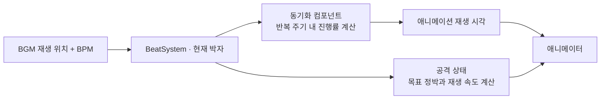

# HiFi-Rush 모작

음악의 박자에 맞춰 캐릭터와 환경이 움직이고, 공격의 타격 순간도 정박에 맞추는 리듬 액션 게임입니다. 개인 프로젝트로 **DirectX 11 기반 자체 엔진과 게임 클라이언트**를 설계·구현했습니다.

**[▶ 플레이·구현 시연 영상](https://www.youtube.com/watch?v=L86G_UKz5gA)** · [엔진 코드](Engine) · [게임 코드](HiFi-Rush)

| 항목 | 내용 |
| --- | --- |
| 개발 형태 | 개인 프로젝트 |
| 주요 기술 | C++20, DirectX 11, HLSL, Git |
| 활용 라이브러리 | DirectXTK, FMOD |
| 구현 범위 | 엔진, 렌더링, 리듬·전투 시스템, 몬스터 AI, UI, 리소스 로딩 |

## 주요 구현

| 해결할 요구 | 구현 방식 |
| --- | --- |
| 캐릭터와 환경이 음악의 박자를 공유 | BGM 재생 위치에서 공통 박자를 계산하고 동작별 반복 주기에 맞춰 재생 위치 결정 |
| 입력 시점이 달라도 정박에 타격 | 타격까지 남은 동작과 재생 속도 상한을 함께 고려해 목표 박자·속도 선택 |
| 여러 오브젝트에 같은 기능 적용 | 기능별 컴포넌트 조합, 이벤트 구독, 데이터로 지정한 애니메이션·이펙트 설정 |
| 장면 표현과 렌더링 작업 조절 | Deferred Lighting, 그림자·후처리, 프러스텀 컬링, 정적 메시 배칭·인스턴싱 |

## 1. 음악 박자를 공유하되, 동작에 맞춰 제어 방식 분리

반복 동작은 음악의 현재 박자에 맞춰야 하고, 공격은 입력에 반응해 시작한 뒤 타격까지 이어져야 합니다. **공통 시간은 음악을 기준으로 두고, 반복 동작의 재생 위치와 공격의 재생 속도를 각각 제어**했습니다.

### 반복 동작: 현재 박자를 애니메이션 재생 위치로 변환

Idle은 4박, Run은 2박처럼 애니메이션마다 반복 주기를 지정했습니다. 현재 박자의 주기 내 진행률에 클립 길이를 곱해 재생 시각으로 변환합니다. 캐릭터와 환경에 같은 동기화 컴포넌트를 적용하고, 반복 주기와 위상은 설정으로 구분합니다.

음악에 따른 계산은 게임의 동기화 컴포넌트가 맡습니다. 엔진의 애니메이터는 전달받은 시각의 포즈를 적용하며, 외부 시각이 주어지지 않으면 일반적인 deltaTime 기반 재생을 사용합니다.

[박자 계산](HiFi-Rush/BeatSystem.cpp) · [주기·위상 계산](HiFi-Rush/BeatMath.h) · [동기화 컴포넌트](HiFi-Rush/BeatSkeletalAnimationSyncComponent.cpp) · [애니메이터](Engine/SkeletalAnimatorComponent.cpp)

### 공격: 허용 속도로 도달할 수 있는 정박 선택

바로 다음 정박에 무조건 맞추면 남은 시간이 짧을수록 공격 동작이 지나치게 빨라집니다. 블렌드 시작 위치부터 타격 마커까지 남은 동작을 기준으로 필요한 재생 속도를 계산하고, 속도 상한을 넘으면 뒤의 정박을 선택합니다.

타격 시점은 애니메이션 Notify와 연결하고, 타격 이후에는 기본 재생 속도로 복원합니다. **입력의 리듬 판정과 실제 타격 시점 제어를 구분**해 처리했습니다.

[목표 박자·속도 계산과 타격 처리](HiFi-Rush/ChiAttackState.cpp) · [리듬 입력 판정](HiFi-Rush/RhythmInputJudge.cpp)

## 2. 기능을 컴포넌트로 조합하고 이벤트로 연결

게임 오브젝트에 필요한 컴포넌트를 추가하는 방식으로 이동, 체력, 피격, 사운드 등의 역할을 나눴습니다. 템플릿 기반 추가·탐색 함수를 사용하고, 오브젝트가 `std::unique_ptr`로 컴포넌트를 소유합니다.

- **이벤트 구독:** 람다와 `std::function`으로 반응 코드를 등록합니다. 예를 들어 체력 컴포넌트는 피격 이벤트를 발행하고, 오디오 컴포넌트가 구독해 효과음을 재생합니다.
- **구독·객체 수명:** 구독 연결 객체가 소멸할 때 연결을 해제합니다. 삭제 요청된 게임 오브젝트는 `PendingDestroy`로 표시하고 프레임 종료 시 등록 해제와 실제 삭제를 수행합니다.
- **데이터에 따른 구성:** 환경 오브젝트의 컴포넌트, 반복 주기, 애니메이션 설정과 이펙트 프리셋을 데이터로 구성합니다. Trigger와 Animation Notify를 통해 정해진 시점의 동작을 연결합니다.

공통 기능은 `Engine`, 게임 고유의 규칙과 콘텐츠는 `HiFi-Rush`에 두었습니다. 이후 엔진을 SDK 형태로 구성해 [TCP 멀티플레이 데모](https://github.com/HGM2695/NetworkDemo)에도 재사용했습니다.

[오브젝트·컴포넌트](Engine/GameObject.h) · [이벤트 구독](Engine/Event.h) · [프레임 종료 시 삭제](Engine/Scene.cpp) · [피격 사운드 구독 사례](HiFi-Rush/ChiAudioComponent.cpp) · [환경 컴포넌트 구성](HiFi-Rush/EnvironmentComponentFactory.cpp)

### 주요 설계 패턴

| 해결하려는 문제 | 적용한 설계 |
| --- | --- |
| 게임 오브젝트가 기능 추가에 따라 비대해지는 문제 | **Component**를 조합하여 이동, 체력, 충돌, 사운드 등의 책임 분리 |
| 플레이어와 몬스터의 복잡한 행동 분기 | **State** 객체로 행동과 전이 로직을 분리 |
| 피격, 충돌, 애니메이션 이벤트에 여러 시스템이 반응하는 구조 | **Observer**로 사건의 발행자와 반응하는 객체의 직접 의존 제거 |
| 설정 항목이 많은 Material의 복잡한 생성 과정 | **Builder**로 셰이더, 텍스처와 렌더 상태를 단계적으로 구성 |
| 계층적인 UI 구성과 공통 생명주기 처리 | **Composite**로 Widget 트리를 구성하고, **Template Method·Factory Method**로 초기화 순서와 UI별 생성을 분리 |
| 렌더링 코드가 DirectX 11 구현에 직접 결합되는 문제 | **Abstract Factory·Adapter**로 그래픽 자원 생성과 명령 실행을 엔진 인터페이스 뒤로 분리 |

[상태 머신](HiFi-Rush/ChiStateMachineComponent.cpp) ·
[이벤트 시스템](Engine/Event.h) ·
[Material Builder](Engine/Material.h) ·
[Widget 트리](Engine/Widget.h) ·
[그래픽 리소스 Factory](Engine/IGraphicsResourceFactory.h) ·
[D3D11 명령 변환](Engine/D3D11GraphicsCommandContext.cpp)

## 3. 렌더링 중간 결과를 조합해 최종 화면 구성

G-Buffer에 기록한 색상·법선·재질 등의 정보와 Scene Depth를 활용해 조명을 계산하고, 그림자와 화면 공간 효과를 적용했습니다.

| 구분 | 구현 내용 |
| --- | --- |
| 기본 렌더링 | 불투명·마스킹 메시의 G-Buffer 생성, Deferred Lighting, 투명 오브젝트의 별도 렌더 경로 |
| 그림자 | 카메라 시야를 거리별로 나누는 CSM, PCF 필터링 |
| 화면 공간 효과 | SSAO, Screen Space Outline, Depth Fog |
| 후처리 | HDR Bloom, Tone Mapping, FXAA |
| 렌더링 작업 감소 | 프러스텀 밖 메시 제외, 불투명·마스킹 정적 메시의 메시·재질 상태·인덱스 구간별 배칭, 지원 셰이더를 사용하는 배치의 인스턴싱, 캐스케이드별 그림자 생성 대상 선별 |

HDR Scene Color A/B는 후처리의 입력과 출력을 번갈아 맡습니다. 한 패스가 이전 결과를 읽어 다른 텍스처에 기록하면, 다음 패스에서 두 역할을 교환하는 방식으로 화면을 이어서 처리합니다.

디버그 화면에서 G-Buffer, SSAO, 외곽선, Bloom 등 중간 결과를 선택해 볼 수 있으며, 컬링과 인스턴싱을 전환하고 렌더링 대상 수·드로우 콜 수를 확인할 수 있도록 했습니다.

[렌더링 순서](Engine/Renderer.cpp) · [정적 메시 배칭·인스턴싱](Engine/StaticMeshRenderPass.cpp) · [CSM](Engine/CascadedShadowMap.cpp) · [그림자 생성 대상 선별](Engine/ShadowCasterPass.cpp) · [셰이더](Engine/Shaders)

## 게임플레이와 리소스 로딩

| 영역 | 구현 내용 |
| --- | --- |
| 플레이어 | 상태 머신, 이동·점프·대시, 약·강 공격과 콤보, 리듬 판정, Beat Hit Attack, 피격 |
| 몬스터 | Sword·Gunner의 상태와 공격, Qamil 보스의 페이즈·공격 패턴 |
| 장면 | 타이틀, 튜토리얼, 외부 필드, 보스 전투, 로딩 화면 |
| 로딩 | `std::async`로 장면 리소스를 로드하고 완료 여부를 확인한 뒤 메인 스레드에서 등록·장면 전환 |

[플레이어 상태 머신](HiFi-Rush/ChiStateMachineComponent.cpp) · [Sword](HiFi-Rush/SwordStateMachineComponent.cpp) · [Gunner](HiFi-Rush/GunnerStateMachineComponent.cpp) · [Qamil](HiFi-Rush/QamilStateMachineComponent.cpp) · [비동기 로딩](HiFi-Rush/CommonLoadingScene.cpp)

## 조작

| 입력 | 동작 |
| --- | --- |
| W / A / S / D | 이동 |
| 마우스 이동 | 카메라 회전 |
| 마우스 왼쪽 / 오른쪽 버튼 | 약 공격 / 강 공격 |
| Space | 점프 |
| 왼쪽 Shift | 대시 |
| Tab | 게임플레이 UI 표시 전환 |
| Esc | 게임플레이 중 커서 잠금 전환 |

## 개발 환경

- Windows, Visual Studio 2022의 C++ 데스크톱 개발 환경, MSVC v143, Windows SDK 10.0
- C++20 / x64, DirectXTK 헤더·라이브러리·DLL, FMOD 헤더·라이브러리·DLL
- 솔루션: [`HiFi-Rush.sln`](HiFi-Rush.sln). `Engine` 정적 라이브러리와 `HiFi-Rush` 실행 프로젝트로 구성됩니다.

**게임 리소스와 `ThirdParty`는 Git 관리 대상에서 제외되어 있습니다.** 
공개 저장소만 복제한 상태에서는 게임 실행에 필요한 자료가 모두 갖춰지지 않습니다. 
구현 결과는 위 시연 영상에서 확인할 수 있습니다.
