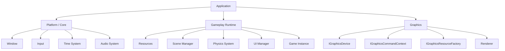
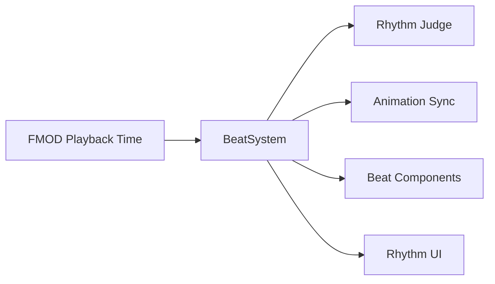
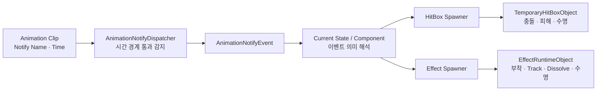

게임플레이 영상 링크 

# Hi-Fi RUSH — C++ / DirectX 11

> C++20과 DirectX 11 기반으로 게임 엔진과 리듬 액션 클라이언트를 직접 설계·구현한 개인 프로젝트입니다.  
> 음원의 실제 재생 시각을 공통 기준으로 사용하여 전투, 애니메이션, UI와 환경 오브젝트를 하나의 Beat에 동기화했습니다.

<p align="center">
  <a href="https://www.youtube.com/watch?v=OX_QslIlpx0"><b>▶ 게임 플레이 영상 보기</b></a>
</p>

## Build & Run

> [!IMPORTANT]
> 이 저장소는 직접 작성한 Engine·Game Client Source Code와 Shader를 검토하기 위한 저장소입니다. 원작 게임의 Model, Animation, Texture와 Sound Resource 및 Third-Party Binary는 저작권과 배포 조건에 따라 포함하지 않습니다. 따라서 Clean Clone만으로 즉시 실행되는 Self-contained 저장소는 아닙니다.

## Project Overview

| 항목 | 내용 |
|---|---|
| 개발 형태 | 개인 프로젝트 |
| 개발 기간 | 2026.02 ~ 2026.08 |
| 담당 범위 | 엔진, 렌더링 파이프라인과 게임 클라이언트 전반 |
| 언어 | C++20, HLSL |
| 그래픽스 | DirectX 11 |
| 플랫폼 | Windows x64 |
| 개발 환경 | Visual Studio 2022, MSVC v143, Windows 10 SDK |
| 주요 라이브러리 | FMOD, DirectXTK |

### 목표

- 클라이언트가 DirectX 11 구체 타입을 직접 다루지 않고 추상화된 그래픽스 인터페이스를 사용하도록 구성
- 음악의 Beat에 맞춰 전투, 애니메이션, UI와 환경 오브젝트가 함께 움직이는 게임플레이 구현
- GameObject가 그리는 방법을 알지 않고 Render Item만 제출하는 렌더링 구조 설계
- 애니메이션 시점, 상태의 의미 해석과 Runtime 객체의 실행 책임을 분리하여 콘텐츠 확장성 확보

## Key Features

| 영역 | 핵심 구현 |
|---|---|
| Engine Runtime | Application, Scene, GameObject·Component 수명 주기와 Tick Group |
| Rhythm System | Audio 재생 시각 기반 Beat 계산, ms 단위 입력 판정과 애니메이션 속도 동기화 |
| Character & Combat | 상태 머신, Combo, Branch, Cancel, Input Buffer, Auto Targeting과 Beat Hit |
| Rendering | G-Buffer 기반 Deferred Rendering, Toon Lighting, CSM·PCF Shadow |
| Post Process | SSAO, Screen Space Outline, Depth Fog, HDR Bloom, Tone Mapping과 FXAA |
| Content Runtime | Animation Notify, Event Publisher, Trigger와 Effect Preset 기반 실행 구조 |
| Optimization | Frustum Culling, Static Mesh Batching·Instancing, Section 기반 Render Queue |
| Debugging | Render Target, Collision·NavMesh 시각화와 실시간 렌더 설정 조절 |

## Architecture

엔진은 `Platform / Core`, `Gameplay Runtime`, `Graphics` 영역으로 책임을 분리했습니다. 현재 렌더링 백엔드는 DirectX 11이며, 게임 클라이언트는 `IGraphicsDevice`, `IGraphicsCommandContext`, `IGraphicsResourceFactory`를 통해 이를 사용합니다.



### 주요 클래스의 책임

- **Application**: 엔진 시스템 소유, Win32 Message Loop와 Frame Loop 실행
- **GameInstance**: 게임 리소스, Scene과 `BeatSystem` 등 게임 전역 시스템 구성
- **Scene**: GameObject 생성·제거 예약, Tick과 Render Data 수집 관리
- **GameObject / Component**: 객체의 정체성과 이동·렌더링·충돌·게임 규칙을 조합 가능한 기능으로 분리
- **Renderer**: 제출된 Render Item 분류·정렬, Render Pass 실행과 최종 화면 합성

주요 코드: [`Application`](Engine/Application.cpp) · [`Scene`](Engine/Scene.cpp) · [`GameObject`](Engine/GameObject.cpp) · [`Renderer`](Engine/Renderer.cpp) · [`HiFiRushGameInstance`](HiFi-Rush/HiFiRushGameInstance.cpp)

## Frame Lifecycle

한 프레임 안에서 게임 로직, 애니메이션, 이동, 물리, 부착 관계와 카메라가 명시된 순서로 실행됩니다. GameObject의 생성과 제거는 Frame 경계에서 반영하여 순회 중 컨테이너 변경을 방지합니다.

```mermaid
flowchart LR
    Message[Win32 Message] --> System[Input · Time · Audio · UI]
    System --> Begin[Scene BeginFrame]
    Begin --> Logic[Game Logic]
    Logic --> Animation[Animation]
    Animation --> Movement[Movement]
    Movement --> Physics[Physics]
    Physics --> Post[Post Physics]
    Post --> Attachment[Attachment]
    Attachment --> Camera[Camera]
    Camera --> Submit[Render Data Submit]
    Submit --> Render[Render Pass]
    Render --> End[Scene EndFrame]
```



## Technical Highlights

### 1. 하나의 Audio Clock으로 전체 장면 동기화

#### 문제

요구사항은 모든 오브젝트와 애니메이션이 음악의 Beat에 맞춰 움직이는 것이었습니다. 각 오브젝트가 Delta Time을 개별 누적하면 생성·활성화 시점에 따라 기준 시간이 달라지고, 음악과 연출 사이에 누적 오차가 생길 수 있습니다.

#### 해결

FMOD BGM 채널의 실제 재생 시각을 단일 기준 시계로 사용했습니다. `BeatSystem`이 재생 시각, BPM과 곡별 Offset으로 현재 Beat·Beat Index·진행률을 계산하고, 각 시스템은 시간을 직접 누적하는 대신 같은 Beat를 조회합니다.



- `RhythmJudge`가 가장 가까운 정박과 입력의 차이를 ms 단위로 계산
- 기본 판정 범위: `Perfect ±45 ms`, `Good ±90 ms`
- 공격 Impact가 목표 정박에 도달하도록 애니메이션 재생 속도 보정
- 이동, 회전, 가시성, Texture Sequence와 UV 이동을 `Beat*Component`로 캡슐화

#### 결과

프레임 변동과 오브젝트 활성화 시점에 따른 누적 오차를 방지하고, 음악·전투 애니메이션·UI와 환경 연출을 하나의 Beat 기준으로 동기화했습니다. 새로운 연출도 엔진 수정 없이 전용 Component를 조합하여 확장할 수 있습니다.

주요 코드: [`BeatSystem`](HiFi-Rush/BeatSystem.cpp) · [`RhythmInputJudge`](HiFi-Rush/RhythmInputJudge.cpp) · [`BeatMoveComponent`](HiFi-Rush/BeatMoveComponent.cpp) · [`BeatSkeletalAnimationSyncComponent`](HiFi-Rush/BeatSkeletalAnimationSyncComponent.cpp)

### 2. Animation Notify와 Runtime 실행 책임 분리

State가 Animation 시간을 매 Tick 검사하면서 HitBox·Effect 생성과 수명까지 직접 관리하면, 타이밍 데이터와 Runtime 구현이 한곳에 결합됩니다.



| 계층 | 책임 |
|---|---|
| Animation Notify | **언제** 실행할지 이름과 시점만 전달 |
| State / Component | 현재 상태에서 **무엇을** 요청할지 해석 |
| Spawner | 설정을 검증하고 Runtime Object 생성 정보 구성 |
| Runtime Object | 충돌, 부착, Track 진행과 수명 등 **어떻게** 실행할지 소유 |

활성 State는 필요한 Notify만 구독하고 State 종료 시 `EventConnection`을 해제합니다. 이에 따라 Animation 타이밍은 Notify Data에서, 실행 방식은 Spawner와 Runtime Object에서 독립적으로 변경할 수 있습니다.

주요 코드: [`AnimationNotify`](Engine/AnimationNotify.cpp) · [`SkeletalAnimatorComponent`](Engine/SkeletalAnimatorComponent.cpp) · [`ChiAttackState`](HiFi-Rush/ChiAttackState.cpp) · [`EffectSpawner`](HiFi-Rush/EffectSpawner.cpp) · [`EffectRuntimeObject`](HiFi-Rush/EffectRuntimeObject.cpp)

### 3. GameObject와 렌더링 정책 분리

각 GameObject가 직접 Draw 순서와 Pipeline State를 결정하지 않습니다. Render Component는 Render Item만 제출하고, Renderer가 Material의 `SurfaceMode`, `ShadingModel`과 Mesh Section을 기준으로 Queue를 구성합니다.

- Opaque·Masked Section을 먼저 렌더링하고 Transparent는 Back-to-Front로 정렬
- Camera Frustum과 Bounding Volume을 이용한 Static·Skeletal Mesh Culling
- Mesh·Material·Pipeline State 기준 Static Mesh Batch 구성
- 동일 Mesh와 Material을 Instance Buffer로 묶어 `DrawIndexedInstanced` 실행
- Opaque·Masked Section만 Shadow Caster로 제출

이 구조를 통해 GameObject는 장면에서의 역할에 집중하고, 정렬·배칭·인스턴싱과 Render Pass 정책은 Renderer에서 일관되게 처리합니다.

주요 코드: [`Renderer`](Engine/Renderer.cpp) · [`StaticMeshRenderPass`](Engine/StaticMeshRenderPass.cpp) · [`SkeletalMeshRenderPass`](Engine/SkeletalMeshRenderPass.cpp)

## Rendering Pipeline

Opaque·Masked는 G-Buffer에 기록하고 조명을 Deferred로 계산합니다. Transparent와 World Sprite는 조명 합성 이후 Forward로 렌더링하며, UI와 Text는 Tone Mapping과 FXAA 이후 BackBuffer에 출력합니다.

```mermaid
flowchart LR
    Submit[Render Item Submit]
    Cull[Culling · Batching]
    Shadow[CSM Shadow]
    GBuffer[G-Buffer]
    SSAO[SSAO]
    Deferred[Deferred Lighting]
    Outline[Screen Space Outline]
    Fog[Opaque Depth Fog]
    Forward[Transparent Forward<br/>Forward Fog]
    Bloom[HDR Bloom]
    Tone[Tone Mapping]
    FXAA[FXAA]
    UI[UI · Text]

    Submit --> Cull --> Shadow --> GBuffer --> SSAO --> Deferred
    Deferred --> Outline --> Fog --> Forward --> Bloom --> Tone --> FXAA --> UI
```



### G-Buffer 계약

| Target | 저장 데이터 |
|---|---|
| Base Color | Material 기본 색상 |
| World Normal | World Space Normal |
| Material Data | AO, Shading Model과 Outline Flag |
| Emissive | HDR Emissive Color |
| Scene Depth | World Position 복원과 후처리 입력 |

### 구현 기능

- Directional, Point와 Spot Light
- 양자화된 Lambert 기반 Toon Lighting과 Normal Mapping
- Cascaded Shadow Maps와 PCF Shadow
- SSAO와 Bilateral Blur
- Depth·Normal 기반 Screen Space Outline
- Depth Fog, HDR Bloom, Tone Mapping·Exposure와 FXAA
- Render Target, Cascade와 Shadow Map 디버그 시각화

## Gameplay Systems

### Player Combat

- 약·강공격 Combo와 Branch Attack
- Cancel 시작 시점과 Input Buffer
- Perfect, Good과 OffBeat 판정
- Jump·Double Jump, Dash와 공중 연계
- Auto Targeting과 공격 시작 방향 보정
- Beat Hit 추가타와 Reverb 기반 Hibiki Attack
- 공격별 HitBox 형태, Hit Reaction과 Knockback

### Monster & Boss

- Sword와 Gunner의 상태 머신 및 공격 패턴
- 지상·공중 피격, Launch, Fall과 Death Presentation
- Qamil Boss의 Phase 운영과 플랫폼 이동
- Punch, Stump, Sweep, Missile, Chain과 Laser Attack
- Phase 전환에 따른 환경 Texture·Material·조명 변화
- 선행 전투, Boss Preview와 전투 종료 연출

### Content Runtime

- Trigger ID와 Beat Offset 기반 Event 구조
- Line·Branch 기반 Dialog Sequence와 Rhythm Tutorial
- 클립별 Animation 이동·중력·Blend·Impact·Cancel 설정
- Effect Preset, Track과 Runtime Object
- Scene별 BGM과 Song Offset
- Health, Reverb, Rhythm Meter, Combo와 Beat Hit UI

## Debugging & Validation

기능을 구현하는 데 그치지 않고 문제를 재현하고 값을 검증할 수 있는 Debug Tool을 함께 구성했습니다.

- Base Color, Normal, Material Data, Emissive와 Scene Depth 시각화
- SSAO, Outline, Bloom Contribution과 Shadow Map Debug View
- Cascade 영역 색상 표시
- Collider, HitBox, Navigation Mesh와 Light 범위 시각화
- Rhythm Input의 Beat와 ms 오차 로그
- Ambient, Fog, Bloom, SSAO, Outline과 Shadow 설정 실시간 조절
- Static Mesh 제출·컬링·Batch·Instance 통계 확인

## Playable Scenes

| Scene | 내용 |
|---|---|
| Title | Title Animation과 BGM |
| Tutorial | Dialog, 약·강공격 학습과 Rhythm Tutorial |
| Outside | Trigger 기반 환경 연출과 Monster Wave |
| Qamil | 선행 전투, Boss Phase와 공격 패턴 |
| Test | Model, Lighting과 Rendering 기능 검증 |

## Controls

| 입력 | 동작 |
|---|---|
| `WASD` | 이동 |
| `Mouse` | 카메라 회전 |
| `Left Mouse Button` | 약공격 |
| `Right Mouse Button` | 강공격 |
| `Space` | Jump / Double Jump |
| `Left Shift` | Dash |
| `Tab` | Gameplay UI 표시 전환 |
| `Esc` | Mouse Capture 전환 |

## Repository Structure

```text
HiFi-Rush/
├─ Engine/                    # 자체 게임 런타임과 D3D11 렌더링 백엔드
│  ├─ Application · Scene    # 생명 주기, Frame Loop와 Scene 관리
│  ├─ GameObject · Component # 컴포넌트 기반 객체 구조
│  ├─ Graphics · RenderPass  # 그래픽스 추상화, Deferred와 Post Process
│  ├─ Animation              # Skeletal Animation, Root Motion과 Notify
│  ├─ Physics · Navigation   # Collider, Rigidbody, Movement와 NavMesh
│  └─ UI · Audio             # Widget Runtime, DirectWrite와 FMOD
│
├─ HiFi-Rush/                 # 게임 클라이언트
│  ├─ Beat · Rhythm           # Beat 계산과 입력 판정
│  ├─ Chi                     # Player State, Combat와 Effect
│  ├─ Monster · Qamil         # 일반 적 AI와 Boss
│  ├─ Scene · Trigger         # Tutorial, Outside, Qamil과 환경 연출
│  └─ Widget · Dialog         # Gameplay UI와 대화·튜토리얼
│
├─ Docs/                      # 포트폴리오와 기술 문서
└─ HiFi-Rush.sln
```

### Requirements

- Windows 10/11 x64
- Visual Studio 2022
- MSVC v143 Toolset와 Windows 10 SDK
- DirectX 11 지원 GPU
- DirectXTK 개발 파일
- FMOD 개발 파일
- 별도로 준비한 Game Resource Package

### Local Layout

```text
HiFi-Rush/
├─ Engine/
├─ HiFi-Rush/
│  └─ Resources/             # Git에서 제외된 Game Resource
├─ ThirdParty/
│  └─ FMOD/                  # Git에서 제외된 Header, LIB와 DLL
└─ HiFi-Rush.sln
```

### Build

1. `HiFi-Rush.sln`을 Visual Studio 2022로 엽니다.
2. DirectXTK Header와 `DirectXTK.lib`가 MSVC에서 검색되도록 개발 환경을 구성합니다.
3. Platform을 `x64`로 설정합니다.
4. `Debug`, `DevRelease` 또는 `Release` Configuration으로 Solution을 Build합니다.
5. 시작 프로젝트를 `HiFi-Rush`로 지정합니다.
6. Runtime Resource 상대 경로를 위해 Working Directory를 `$(ProjectDir)`로 설정하고 실행합니다.

| Configuration | 용도 |
|---|---|
| Debug | 디버깅과 Memory Leak 검사 |
| DevRelease | 최적화된 실행 환경에서 Debug Tool 사용 |
| Release | 배포용 실행 |

## Contribution

본 프로젝트는 개인 프로젝트이며 다음 영역을 직접 설계하고 구현했습니다.

- C++20 기반 Game Runtime과 D3D11 Rendering Backend
- Graphics Interface와 Resource·Command 추상화
- Deferred Rendering, Lighting, Shadow와 Post Process
- Scene, GameObject·Component, Animation, Physics, UI와 Audio 연동
- Beat 동기화와 Rhythm Input 판정
- Player, Monster와 Boss Gameplay
- Effect, Trigger, Dialog와 Gameplay UI
- Debug Visualization과 Runtime Parameter Tool

Model, Animation, Texture와 Sound 등 원작 Resource 제작은 담당 범위에 포함되지 않습니다.

## Disclaimer

이 프로젝트는 학습 및 포트폴리오 목적으로 제작한 비상업적 팬 프로젝트입니다.  
`Hi-Fi RUSH`와 관련된 상표 및 원본 Resource의 권리는 각 권리자에게 있습니다.  
저장소는 직접 작성한 Engine 및 Game Client Source Code를 중심으로 공개합니다.
